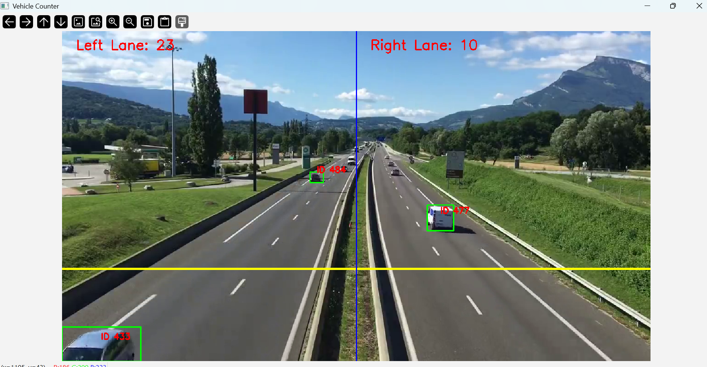
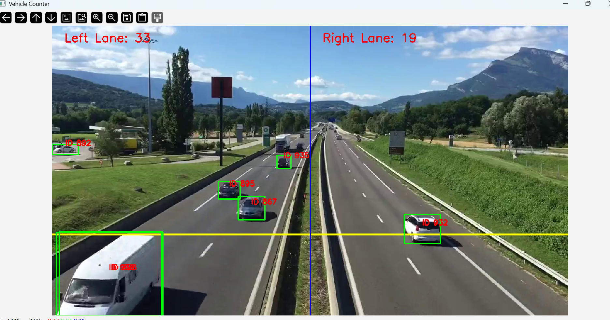

# 🚗 Vehicle Counter with YOLOv8 + OpenCV

This project detects vehicles in a video stream and counts how many cross each lane using YOLOv8 + OpenCV.

## Features
- Real-time vehicle detection
- Left/Right lane crossing counters
- Powered by Ultralytics YOLOv8
## Demo

Here are some screenshots from the project:





## Run Locally
```bash
conda create -n vehicle-count python=3.10
conda activate vehicle-count
pip install -r requirements.txt
python vehicle_detection.py

---

### 🔹 Step 3. Deploy to Vercel (as a static site)  
1. Go to [vercel.com](https://vercel.com) and log in with GitHub.  
2. Click **"New Project" → Import from GitHub**.  
3. Select your repo (`vehicle-counter`).  
4. Vercel will deploy it as a static site (it will just show your `README.md` or docs).  
   - If you want a nicer presentation, add an `index.html` page in your repo (like a mini portfolio page with project details, screenshots, demo video).  

✅ After deploy, you’ll get a live link like:  
