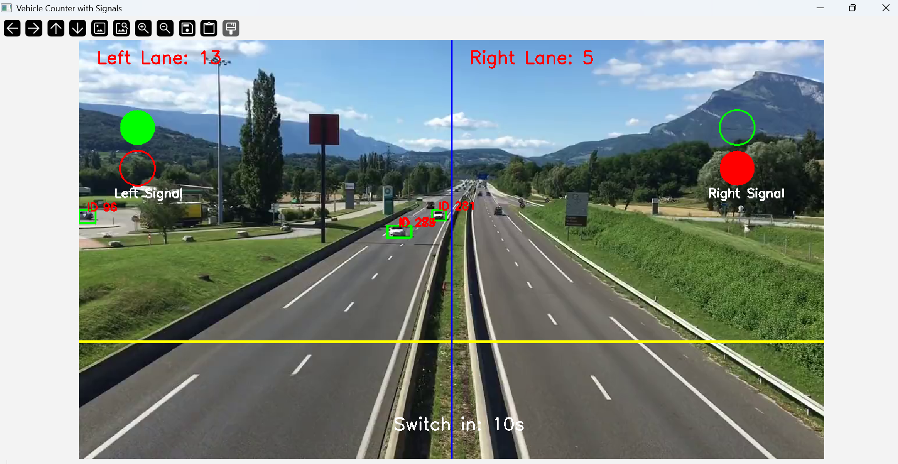
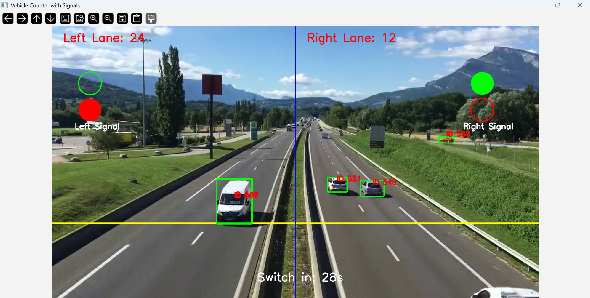

# 🚗 Vehicle Counter with YOLOv8 + OpenCV

This project detects vehicles in a video stream and counts how many cross each lane using YOLOv8 + OpenCV.

## Features
- Real-time vehicle detection
- Left/Right lane crossing counters
- Powered by Ultralytics YOLOv8
## Demo

Here are some screenshots from the project:





## Run Locally
```bash
conda create -n vehicle-count python=3.10
conda activate vehicle-count
pip install -r requirements.txt
python vehicle_detection.py
```

## 🚦 Traffic Light Logic

Vehicle counts are continuously monitored per lane

Every 30 seconds (configurable):

The lane with more vehicles gets the green signal

Other lane gets red, but still receives minimum green time in next cycle

Prevents starvation → ensures fair switching

## 🛠️ Tech Stack

Python 3.10

YOLOv8 (Ultralytics) – object detection

OpenCV – video processing & visualization


